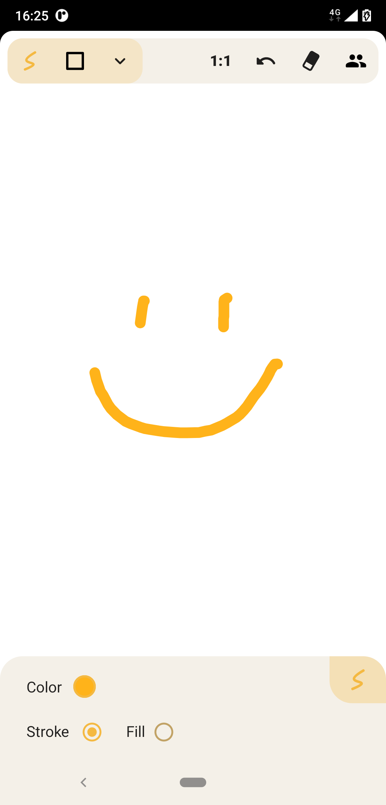
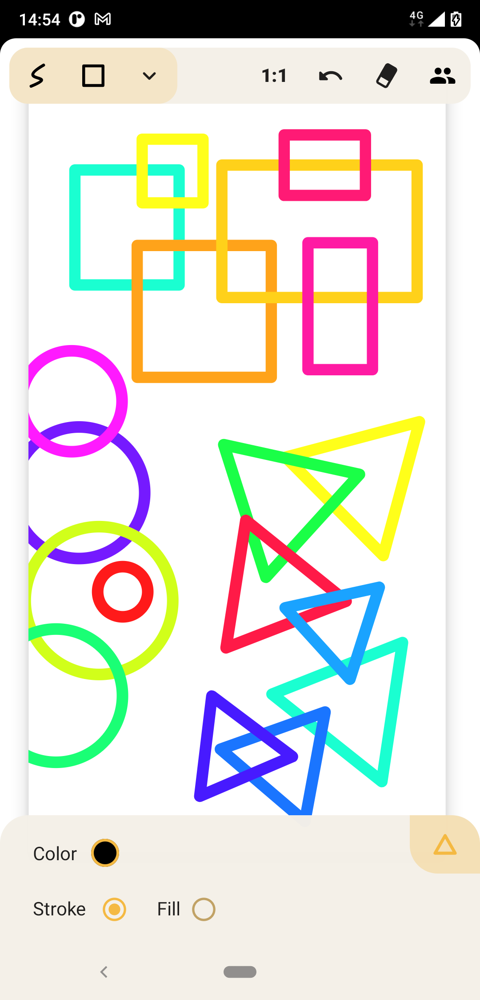
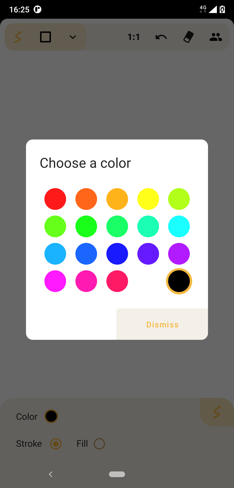
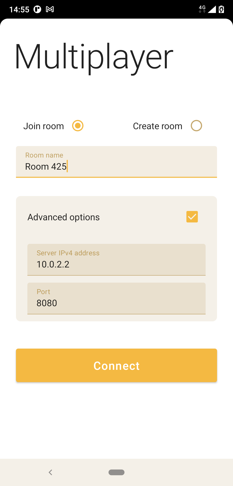

# Freedrawing

### A free drawing app made with android Jetpack Compose 🖌

This app allows to draw different figures with one finger. You can move
the canvas or zoom out with two fingers.

It is also possible to draw in **multiplayer** mode by connecting to the
[free drawing server](https://github.com/Christophe-github/FreeDrawingServer) and joining a room.

Features:

* Draw lines, circles, squares and triangles
* Possibility to have the figures filled or outlined
* Choose the line width in case of outlined figures
* Choose a color for your figures
* Activate the random color mode to randomize the color for each new figure 🔴🟢🔵🟡🟠
* Erase the last figure drawn
* Erase the whole canvas
* Zoom out or pan the view with two fingers
* Connect to the multiplayer server, join or create a room, and draw simultaneously with other people! 🧑🧑🧑

Multiplayer with web server relies on websockets, thanks to [Java-WebSocket](https://github.com/TooTallNate/Java-WebSocket) for making this possible

## Compatibility

| data        | value |
|-------------|-------|
| min sdk     | 21    |
| compile sdk | 33    |

## Screenshots

